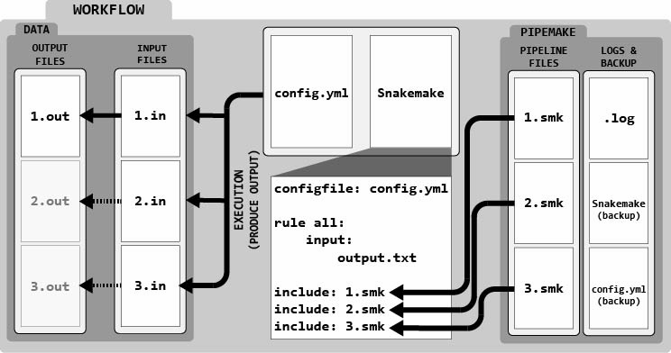

.. _about:

#####
About
#####

*****************
What is pipemake?
*****************

The goal of pipemake is to provide a lightweight, flexible, and easy-to-use tool for managing and creating `Snakemake <https://snakemake.readthedocs.io/>`_ pipelines. Snakemake is a popular workflow management system for creating reproducible and scalable data analyses.

For the majority of users, pipemake provides a collection of curated and customizable genomic analysis pipelines that provide the benefits of Snakemake without the need to learn Snakemake syntax. To see a list of pipelines available in the basic pipemake installation, see :ref:`pipelines`.

Running most pipelines simply requires users to specify the desired pipeline and the appropriate input files. Pipemake will then automatically create a workflow directory, which stores all the necessary files for running the pipeline. The workflow directories then can be executed using Snakemake, which will handle the execution of all pipeline steps. To see an example of running a pipelines, see :ref:`usage`. 

.. note::

   After running Snakemake, the workflow directory will contain all the Snakemake files, configuration files, input files, and output files.

Workflow directories were devised as a method to simplify record keeping and reproducibility. They enable users to always have a complete record of the pipeline run, including the exact Snakemake rules used, the input files, and the output files generated. This is particularly useful for sharing results with collaborators or for future reference.

******************
Creating Pipelines
******************

For users who want to create their own pipelines, pipemake provides a framework that allows for simplified development of new pipelines.

pipemake uses configurable YAML files to define pipeline, including:

* The command-line arguments for the pipeline
* The process to correctly store the input files (i.e. naming conventions, if the input files are compressed, etc.)
* The required snakemake files
* The snakemake rules to link if their input/output files do not match

While creating configurable YAML may take more time then simply combining existing Snakemake rules, it allows for:

* Benefits of a command-line interface - i.e. directly calling input files, default values, arguments with a limited set of options, etc.
* Simple modification - i.e. adding plotting modules, adding additional options, etc.
* Reusability - i.e. sharing pipelines with collaborators, including pipelines in publications, etc.

User-generated pipelines are also particularly useful for groups that want to maintain a consistent set of pipelines or have unique requirements for their analyses.

For a detailed guide on how to create pipelines (see :ref:`create`).
