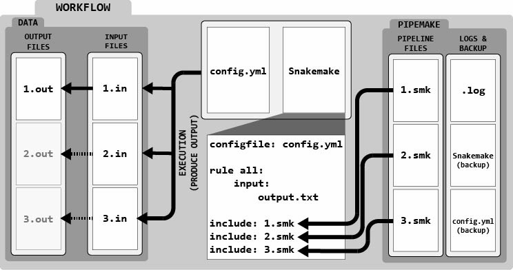

.. _about:

#####
About
#####

*****************
What is pipemake?
*****************

The goal of pipemake is to provide a lightweight, flexible, and easy-to-use tool for managing and creating `Snakemake <https://snakemake.readthedocs.io/>`_ pipelines. Snakemake is a popular workflow management system for creating reproducible and scalable data analyses.

For the majority of users, pipemake provides a collection of curated and customizable genomic analysis pipelines that provide the benefits of Snakemake without the need to learn Snakemake syntax. To see a list of pipelines available in the basic pipemake installation, see :ref:`pipelines`.

Running most pipelines simply requires users to specify the desired pipeline and the appropriate input files. pipemake will then automatically create a workflow directory, which stores all the necessary files for running the pipeline. The workflow directory can then be executed using Snakemake, which will handle the execution of all pipeline steps. To see an example of running a pipeline, see :ref:`usage`.

.. note::

   After running Snakemake, the workflow directory will contain all the Snakemake files, configuration files, input files, and output files.

pipemake does not add any capabilities that Snakemake does not already provide. Instead, it makes Snakemake's reproducibility safeguards automatic, reusable, and accessible to researchers who would otherwise struggle to implement them.

Built-in safeguards
===================

pipemake builds the following safeguards into each pipeline as enforced defaults:

* **Validated arguments** - pipemake pipelines use a command-line interface that confirms input paths exist, enforces parameter types, limits arguments to a set of valid choices, and provides default values where possible. This prevents the silent acceptance of incorrect parameters that can occur with a plain-text configuration file.
* **Mandatory containerization** - Snakemake rules in pipemake run within Singularity or Apptainer containers. This eliminates many operating system constraints, keeps software consistent among users, and removes the need for users to install and maintain the software themselves.
* **Standardized record-keeping** - Every run produces a workflow directory containing the Snakemake file, the configuration file, a backup of the Snakemake modules, the input and output files, and a log of all command-line arguments and file-processing steps. This provides a complete record of the pipeline run, which is particularly useful for sharing results with collaborators, rerunning an analysis, or future reference.

.. note::

   pipemake generates standard Snakemake files. A workflow directory can be run with Snakemake alone, without pipemake, so an analysis can still be reproduced by users who do not have pipemake installed.

Who is pipemake for?
====================

pipemake is designed for:

* Research groups whose members have different levels of computational expertise, where the people who need to run or reproduce an analysis are not always those with the expertise to build and configure it
* Researchers with little Snakemake experience who want the benefits of a reproducible workflow without learning Snakemake syntax
* Groups that want to develop, maintain, and share a consistent set of in-house pipelines

pipemake is most useful for analyses that need to be repeated, shared, or reproduced by someone other than the original designer. For example, it works well for performing the same analysis on multiple species or independent experiments by simply changing the input on the command line.

pipemake is not intended to replace community-curated pipelines, such as those from `nf-core <https://nf-co.re/>`_, where one already exists for the analysis. It is also not intended for experienced developers building a single workflow for their own use, who may find the additional layer unnecessary.

Limitations
===========

* pipemake runs rules within Singularity or Apptainer containers, so it can only be used on systems where one of these is available.
* pipemake lowers the technical barrier to running or composing a workflow, but it does not reduce the conceptual one. The command-line interface identifies problematic configurations, but not scientifically inappropriate ones. Users must still understand the appropriate inputs and parameters for their analysis.

Sharing pipelines and containers
================================

Pipeline files are kept separate from the pipemake platform, which allows a group to share and co-develop a single collection of pipelines. When users share the same pipelines directory, any modifications (updates or new pipelines) are reflected for all users. Likewise, a single directory of Singularity containers may be shared between multiple users. For details on setting up both, see :ref:`environment-variables`.

******************
Creating Pipelines
******************

For users who want to create their own pipelines, pipemake provides a framework that allows for simplified development of new pipelines.

pipemake uses configurable YAML files to define pipelines. A pipeline configuration file is separated into four categories:

* **Pipeline assignment** - The unique pipeline name, version, and description. These are the only requirements to define a pipeline.
* **Parser arguments** - The command-line arguments for the pipeline
* **Input standardization** - The process to correctly store the input files (i.e. naming conventions, if the input files are compressed, etc.)
* **Snakemake file requirements** - The required Snakemake files, and the Snakemake rules to link if their input/output files do not match

The complexity of the command-line arguments and input standardization depends on the desired configurability of the pipeline. At a minimum, only the input requires a command-line argument and a standardization procedure.

pipemake uses standard Snakemake files, which may be added to or removed from a pipeline as needed. Ideally, these files are modular in function and have configurable parameters, which allows them to be reused across multiple pipelines. For example, the creation of a new pipeline is simplified by combining existing Snakemake files with new ones, and by copying the relevant components from the configuration files of existing pipelines that use the same Snakemake files.

While creating configurable YAML may take more time than simply combining existing Snakemake rules, it allows for:

* Benefits of a command-line interface - i.e. directly calling input files, default values, arguments with a limited set of options, etc.
* Simple modification - i.e. adding plotting modules, adding additional options, etc.
* Reusability - i.e. sharing pipelines with collaborators, including pipelines in publications, etc.
* Easy addition of quality control (QC) modules - once a QC module is designed for a particular data type or procedure, it can be readily added to all relevant pipelines without altering other Snakemake files.

User-generated pipelines are also particularly useful for groups that want to maintain a consistent set of pipelines or have unique requirements for their analyses.

For a detailed guide on how to create pipelines, see :ref:`create`.

**************
Example Uses
**************

pipemake has been used to build and run pipelines spanning genomic and non-genomic data, including:

* De novo genome annotation of the sweat bee *Lasioglossum albipes* (``annotate-braker3``)
* A population genomics reanalysis of social behavior in *L. albipes*, including filtering, Fst, PCA, and GWAS (``filter-model-vcf`` and ``reseq-popgen``)
* Automated behavioral tracking in the common eastern bumble bee *Bombus impatiens* using NAPS (``tracking-naps``)

To see the full list of available pipelines, see :ref:`pipelines`.